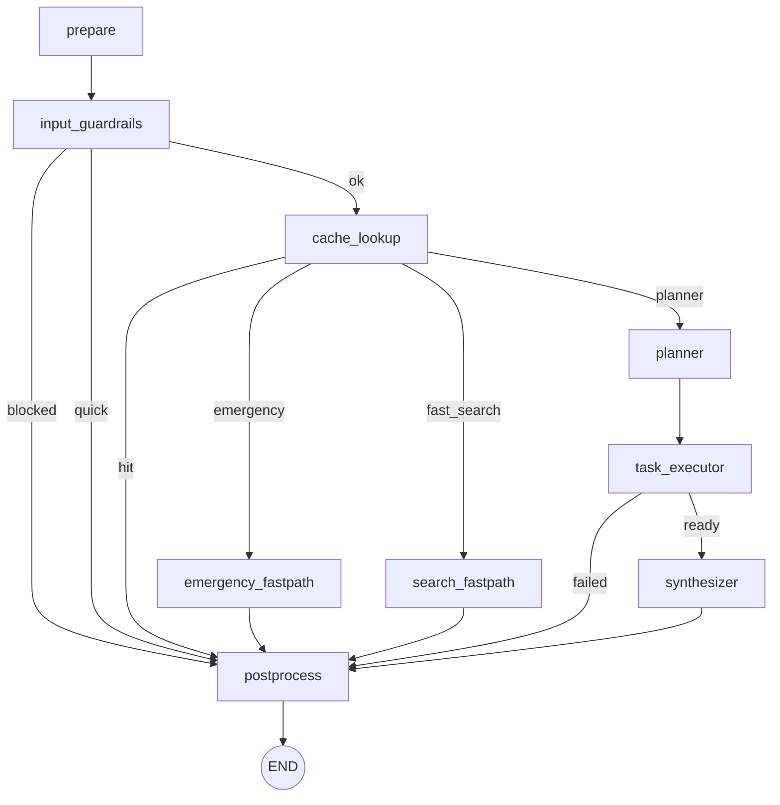

# Travel Agent

A full-stack travel chatbot application with an AI-powered assistant for destinations, itineraries, budgets, and practical travel tips.

## Features

- **Chat interface** — Conversational travel assistant (Gemini) for destination ideas, budgets, and recommendations
- **Modern stack** — Next.js frontend, FastAPI backend, LangGraph for orchestration

## Tech Stack

| Layer      | Technology                    |
|-----------|-------------------------------|
| Frontend   | Next.js 14, React, Tailwind CSS |
| Backend    | FastAPI, Python 3.9+          |
| AI / Chat  | Google Gemini (google-genai)   |
| Orchestration | LangGraph                    |

## Project Structure

```
├── frontend/          # Next.js app (travel chat UI)
├── backend/           # FastAPI app (travel-chat APIs)
│   ├── app/
│   │   ├── main.py
│   │   ├── routes/
│   │   ├── services/
│   │   └── storage/
│   ├── requirements.txt
│   └── .env           # Not committed; see Environment below
├── render.yaml        # Optional: Render.com backend config
├── vercel.json        # Vercel: deploy frontend from frontend/
└── README.md
```

## Local Development

### Prerequisites

- Python 3.9+
- Node.js 18+
- API key: **GEMINI_API_KEY** or **GOOGLE_API_KEY** ([Google AI Studio](https://aistudio.google.com/app/apikey))

### Backend

```bash
cd backend
python -m venv venv
source venv/bin/activate   # Windows: venv\Scripts\activate
pip install -r requirements.txt
```

Create `backend/.env`:

```env
GEMINI_API_KEY=your-gemini-api-key
# or GOOGLE_API_KEY=your-google-api-key
GOOGLE_GENAI_USE_VERTEXAI=False
CORS_ORIGINS=http://localhost:3000

# Optional: Langfuse tracing (recommended)
LANGFUSE_PUBLIC_KEY=pk-lf-...
LANGFUSE_SECRET_KEY=sk-lf-...
# EU cloud:
LANGFUSE_BASE_URL=https://cloud.langfuse.com
# US cloud example:
# LANGFUSE_BASE_URL=https://us.cloud.langfuse.com
```

Run the API:

```bash
uvicorn app.main:app --reload --port 8000
```

### Frontend

```bash
cd frontend
npm install
npm run dev
```

Open [http://localhost:3000](http://localhost:3000). The app uses `http://localhost:8000` as the API URL by default.

## Deployment

- **Frontend** — Deploy the `frontend/` directory to [Vercel](https://vercel.com). Set Root Directory to `frontend` and add `NEXT_PUBLIC_API_URL` to your backend URL.
- **Backend** — Deploy the `backend/` directory to [Render](https://render.com) or [Railway](https://railway.app). Set root to `backend`, build with `pip install -r requirements.txt`, start with `uvicorn app.main:app --host 0.0.0.0 --port $PORT`. Add the same env vars as above and set `CORS_ORIGINS` to your Vercel frontend URL.

See the dashboard docs for each platform for exact steps. The repo includes a `render.yaml` for Render and a `vercel.json` for Vercel.

## Environment Variables

| Variable | Where | Description |
|----------|--------|-------------|
| `GEMINI_API_KEY` or `GOOGLE_API_KEY` | Backend | Required for travel chat. |
| `GOOGLE_GENAI_USE_VERTEXAI` | Backend | Set to `False` for Gemini API; `True` for Vertex AI. |
| `CORS_ORIGINS` | Backend | Comma-separated allowed origins (e.g. your Vercel URL). |
| `LANGFUSE_PUBLIC_KEY` | Backend | Optional. Enables Langfuse tracing when paired with secret key. |
| `LANGFUSE_SECRET_KEY` | Backend | Optional. Enables Langfuse tracing when paired with public key. |
| `LANGFUSE_BASE_URL` | Backend | Optional. Langfuse host (`https://cloud.langfuse.com` or `https://us.cloud.langfuse.com`). |
| `NEXT_PUBLIC_API_URL` | Frontend | Backend base URL (e.g. `https://your-api.onrender.com`). |

## Langfuse Sessions

This backend already propagates `session_id` to Langfuse so you can replay conversations in the Sessions view.

- Send `session_id` in each request to `/api/travel-chat` or `/api/travel-chat/stream`
- Reuse the same `session_id` for all turns in one chat thread
- Use a US-ASCII value under 200 chars (Langfuse requirement)

Example request body:

```json
{
  "messages": [
    { "role": "user", "content": "Plan a 3-day Rome trip with food spots" }
  ],
  "session_id": "chat-user-42-thread-1"
}
```

## Travel Chat Graph



## License

MIT
